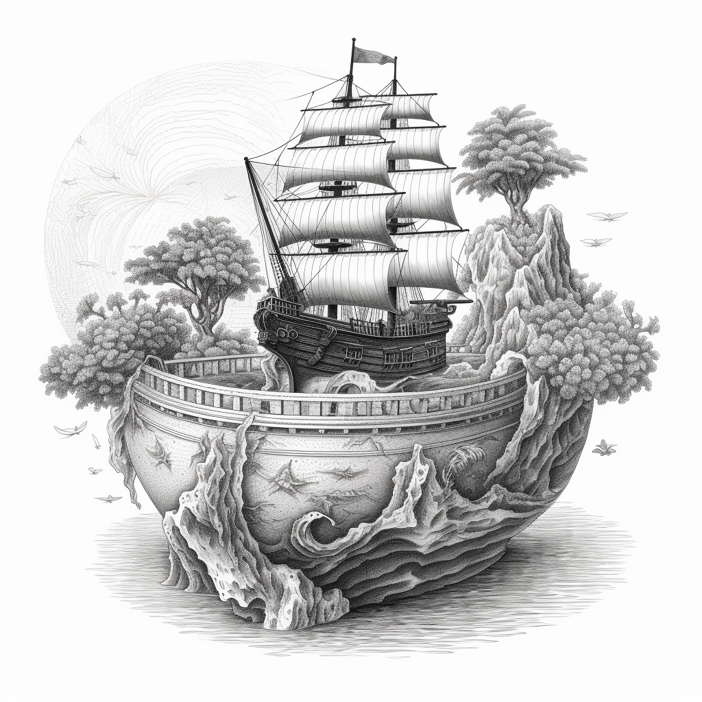

# seapot

seaport with [noir](https://noir-lang.org/)

currently only struct, enums, and consts from [seaport-types](https://github.com/ProjectOpenSea/seaport-types)

will pull over more where it makes sense

> disclaimer: mostly translated using regex & gpt, so probs not perfect
